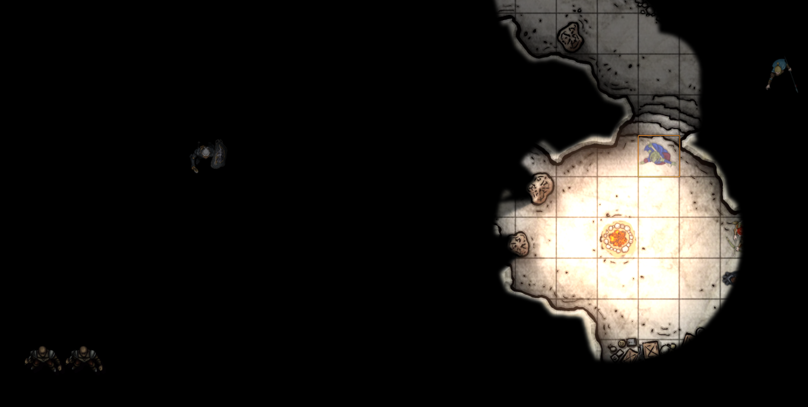
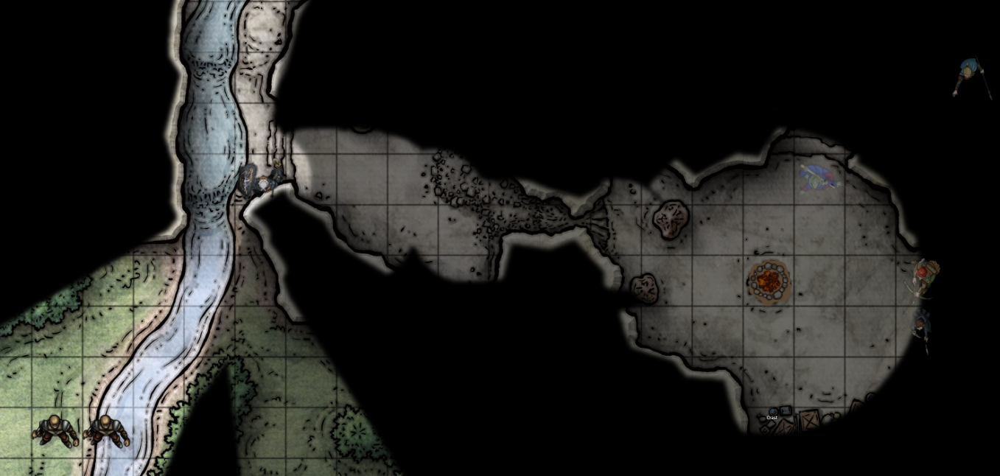

# Foundry VTT Shared Token Visibility

"Shared Token Visibility" is a [Foundry VTT](https://foundryvtt.com/) module that aims to provide a compromise between per-player dynamic lighting and out-of-character coordination.

The goal of this module is to let the GM restrict dynamic lighting per character (**not** providing "Observer" visibility to every token), but allowing players to see each other's positions in a scene as well as the positions of NPCs and monsters that one of their party members sees.

This way, during a party split - or just when half the party is hiding behind a corner - players don't miss out on cool reveals or get tactically hamstrung by the lighting system.

To accomplish this, the module has exactly two features:

1. if a player in your game controls a token, that token is revealed to all players.
1. if any player in your game can see a token, that token is revealed to every other player.

At the time of this writing, these are a package deal, though I am planning to allow opting out of one behavior #2.

## Example

This screenshot shows the perspective of Bhagar, a dragonborn monk, inside a cave next to a campfire:

Bhagar can see his wizard and fighter party members over the fog, as well as two hostile thug tokens that the fighter can see in the lower left corner.

This screenshow shows the perspective of Bale, a goliath fighter, peering outside of the cave:

Even though Bale can't see into the cave, he can still see the position of the rest of his party. The two thugs that he has vision of get shown to his party as well.

## Installation

Load the following manifest into Foundry: https://raw.githubusercontent.com/sfuqua/fvtt-token-visibility/master/module.json

## Notes on compatibility

This section documents how the module works at a high level, to shed light on compatibility risks with other modules.

### Conditional Visibility

At the time of this writing, [Conditional Visibility](https://github.com/gludington/conditional-visibility) is the only published module that had obvious overlap with this one.

I have not tested this module against Conditional Visibility yet.

However, since my module depends on the "sightRefresh" hook to be called at the end of `SightLayer.restrictVisibility`, and Conditional Visibility adds additional behavior _after_ restrictVisibility, there's a good chance weird things will happen.

In order for these modules to work nicely together, Shared Token Visibility would need a way to tell that Conditional Visibility overruled the visibility of a token.

### RevealedTokenLayer

This module works by tampering with `Canvas.layers` in the `"init"` hook. It preserves all existing layers and inserts itself at the end, to create a new CanvasLayer called `RevealedTokenLayer`.

`RevealedTokenLayer` is intended to render on top of Foundry's `SightLayer` (to escape the fog of war), so I set the zIndex to SightLayer + 1.

This module _may_ have compatibility problems with other modules that tamper with Canvas layers, though I don't anticipate any problems.

All UI exists on this layer. The module works by drawing token icons on this layer, using code very similar to how Foundry itself draws tokens on the standard TokenLayer.

### Socket communication

This module dispatches events on its channel (`"module.shared-token-visibility"`) to notify other clients of changes to token visibility and keep everything in sync.
